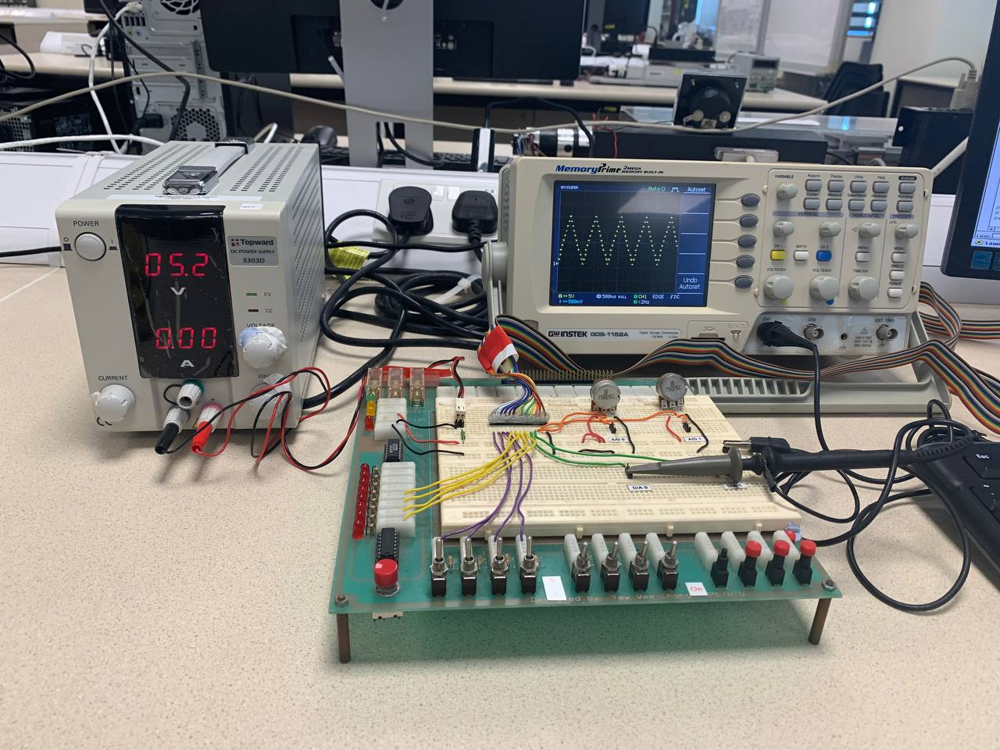
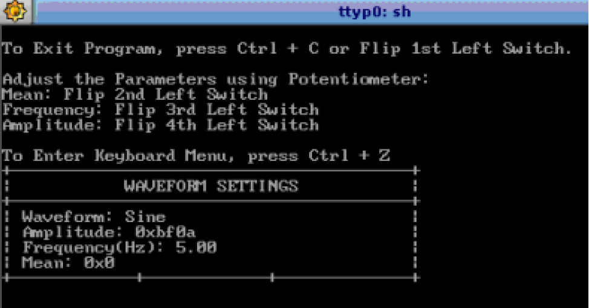
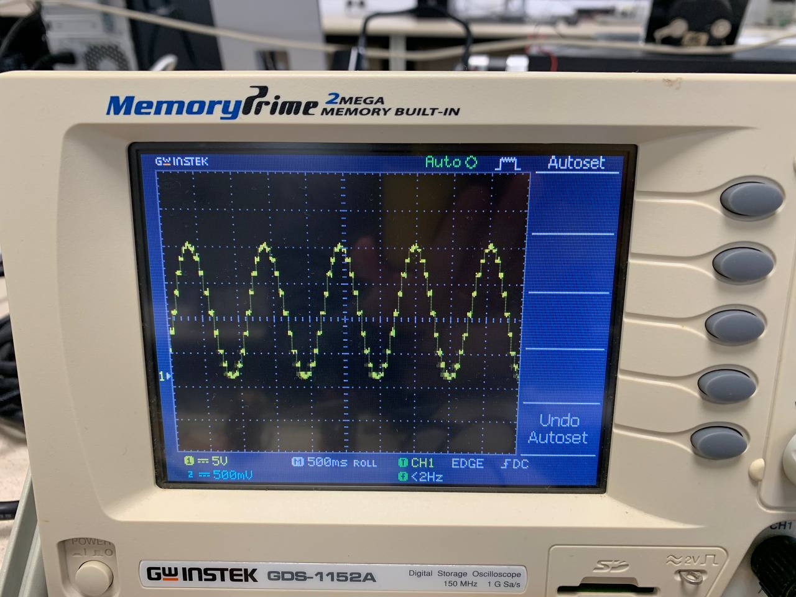
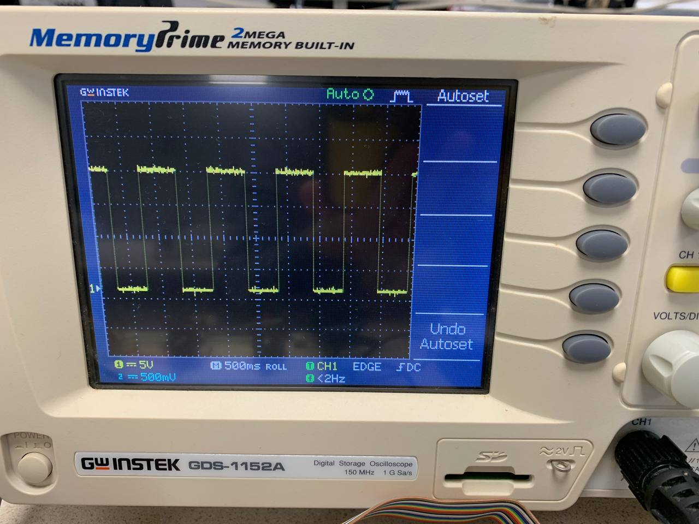
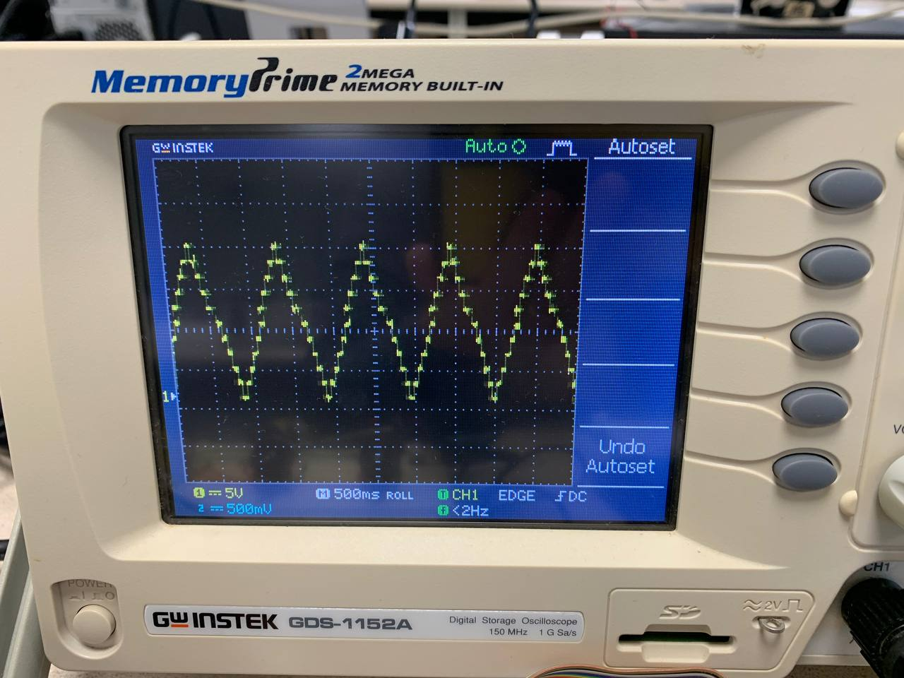
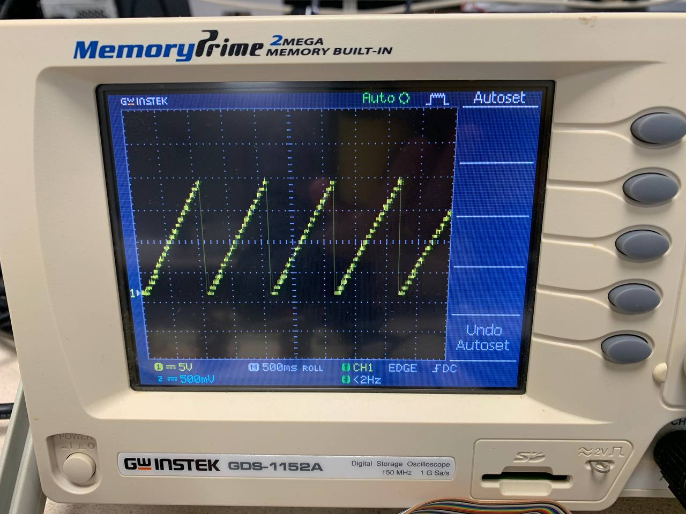

# waveform-generator
Multi-threaded real-time C program to output waveforms for display on an oscilloscope.

The waveform generator was programmed in C programming language on a system running QNX operating system.

### Real-time techniques
The program consists of 3 seperate threads that communicate and synchronise to ensure timely and uninterrupted output of the waveform. Waveform parameters such as amplitude, frequency, and mean value can be adjusted using hardware inputs from toggle switches and potentiometer.

**insert image**

  
   

### Waveform outputs
4 different types of waveforms can be selected through input in the terminal:
- Sine wave
- Square wave
- Triangular wave
- Sawtooth wave

  
   

  
   

  
   

  
   

  
   

